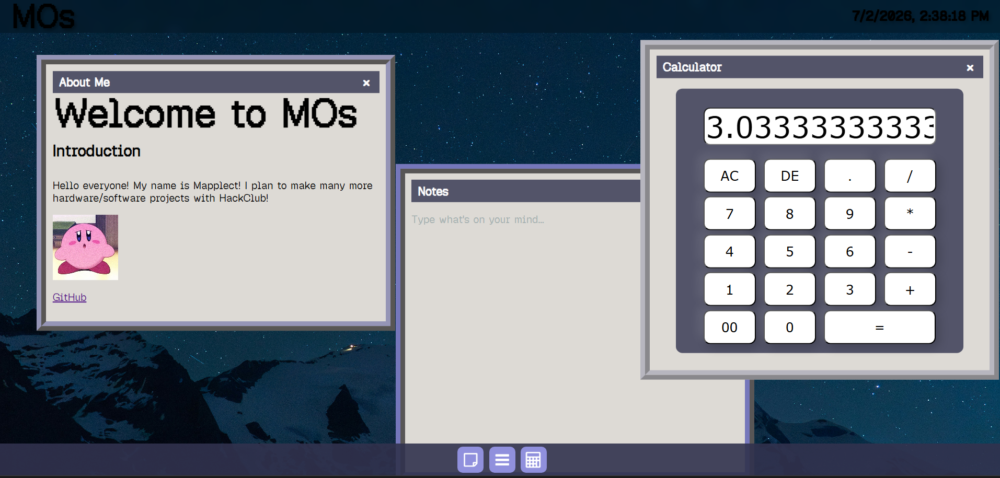

# MWebOS
MOs is a single-page, operating system that runs entirely in your browser.

## Usage Instructions
1. Clone this repository
2. Open `index.html` in a browser.
## Features (V1)
Currently, MOs features 3 different draggable windows. All windows can be closed with the 'x' in the upper right. They can be opened (and closed) by clicking the buttons on the taskbar. 
### Calculator
This is a simple calculator. It can carry out addition, multiplication, divison, and subtraction operations with any numbers you input into the calculator. Decimals can also be typed in.
There is an AC button (All Clear) which deletes every digit currently in the display and a DE button (Delete) which deletes the last digit inputted.

### About Me
This window displays very minimal information about myself, will probably add more to it later. It also has a link to my GitHub Repository, so you can check out my other sub-par projects.

### Notes
This window functions almost like the notepad on Windows. You can type whatever you want into the box and it saves with `localStorage` so you can resume typing your note even after closing the page.

